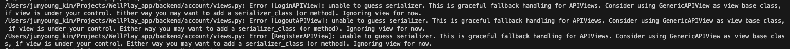
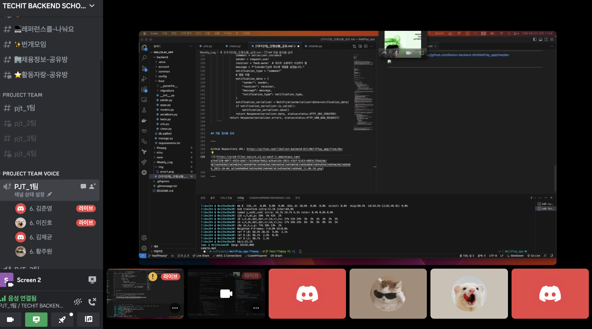

## 팀 구성원, 개인 별 역할

---

김준영: PM 
이진호: 데브옵스 
황주원: 개발 
김제균: 개발 
이노규: 개발 

<br>

## 팀 내부 회의 진행 회차 및 일자

---
- 1회차(2023.09.25) 프로젝트 주제 선정 회의 (김준영, 이진호, 황주원)
- 2회차(2023.09.26) Git브랜치 전략 회의 (김준영, 이진호, 황주원, 김제균, 이노규)
- 3회차(2023.09.26) 모델,API 구성 회의 (김준영, 이진호, 황주원, 김제균, 이노규)
- 4회차(2023.09.27) 연휴간 개발 세분화 및 역할분담 회의 (김준영, 이진호, 황주원, 김제균, 이노규)
- 5회차(2023.10.02) 프로젝트 일정 조율 및 진행방향 회의 (김준영, 이진호)
- 6회차(2023.10.03) Git브랜치 전략 수정 회의 (김준영, 황주원, 김제균)
- 7회차(2023.10.04) 프로젝트 기본기능 개발 완료 발표회 (김준영, 이진호, 황주원, 김제균)
- 8회차(2023.10.04) 프로젝트 프론트엔드,추가기능 회의 (김준영, 이진호, 황주원, 김제균)

<br>

## 현재까지 개발 과정 요약

---

김준영

- git branch전략 수립
- 개발환경 구성
- feed모델, crud 구현
- feed 최신글, 추천글 api구현
- 좋아요기능 구현

이진호

- feed모델/API 설계
- comment모델/API 설계 및 구현
- 알림모델 설계 및 구현
- celery 설정 및 redis 연동 구현

김제균  

- 유저 모델 작성
- api 이용한 Follow view 작성

황주원 

- 유저 모델 작성
- api 이용한 회원가입, 로그인, 로그아웃 view 작성

<br>

## 개발 과정에서 나왔던 질문

---

1. 좋아요 기능 구현시 post 입력 질문
    
    ```python
    class LikeView(generics.CreateAPIView):
        serializer_class = LikeSerializer
        queryset = Like.objects.all()
    
        def post(self, request: Request, *args, **kwargs):
            serializer = self.get_serializer(data=request.data)
            if serializer.is_valid():
                feed = serializer.validated_data["feed"]
                qs = Like.objects.filter(feed=feed, user=request.user)
                if qs.exists():
                    qs.delete()
                    return Response(status=status.HTTP_204_NO_CONTENT)
                else:
                    Like.objects.create(feed=feed, user=request.user)
                    return Response(status=status.HTTP_201_CREATED, data=serializer.data)
            else:
                return Response(status=status.HTTP_400_BAD_REQUEST, data=serializer.errors)
    ```
    
    - 생각을 해보면 좋아요를 눌렀을때 입력을 따로 받지 않는데 user, feed를 입력받아야 정상처리 됨
    - 프론트에서 처리하는것인지? 백엔드에서 입력을 넣어줄수 있는 방법이 있는지 궁금합니다.
    - A. 프론트에서 좋아요 버튼을 눌렀을 경우 user와 feed의 ID를 입력받아야 어떤 데이터베이스에 접근해서 좋아요 처리를 해줄 수 있는지 알 수 있겠죠? 프론트에서도 API를 이용하여 처리를 하기 때문에 백엔드에 입력을 넣어주려고 하면 DB를 직접 수정하거나(비추), API를 따로 호출해서 처리하면 될거예요.
    
    <br>

2. APIViews serializer_class 관련 질문
    
    에러내용
    
    
    
    ```bash
    /Users/junyoung_kim/Projects/WellPlay_app/backend/account/views.py:
     Error [LoginAPIView]: unable to guess serializer.
     This is graceful fallback handling for APIViews.
     Consider using GenericAPIView as view base class,
     if view is under your control.
     Either way you may want to add a serializer_class (or method).
     Ignoring view for now.
    /Users/junyoung_kim/Projects/WellPlay_app/backend/account/views.py: Error [LogoutAPIView]: unable to guess serializer. This is graceful fallback handling for APIViews. Consider using GenericAPIView as view base class, if view is under your control. Either way you may want to add a serializer_class (or method). Ignoring view for now.
    /Users/junyoung_kim/Projects/WellPlay_app/backend/account/views.py: Error [RegisterAPIView]: unable to guess serializer. This is graceful fallback handling for APIViews. Consider using GenericAPIView as view base class, if view is under your control. Either way you may want to add a serializer_class (or method). Ignoring view for now.
    ```
    
    - 시리얼라이저가 확실하지 않다는 에러같습니다
    - APIViews에서 자동으로 처리된것같은데 serializer_class를 추가해줘야하는것같다는 에러인것 같습니다
    - 저도 LikeView할때 APIView로 했다가 저에러가 나와서 그냥 에러문구에 나온대로 GenericAPIView로 바꿔서 했습니다
    - APIViews에서도 serializer_class를 지정할 수 있는지 확인 후 수정해야할 것 같습니다.
    
    https://stackoverflow.com/questions/67649291/drf-spectacular-specify-empty-payload-using-extend-schema
    
    보고 해결했습니다.
    
    `@extend_schema(request=None, responses=UserSerializer)`
    
    라는 데코레이터가 필요하다는데 정확히 어떤 역할인지는 좀 더 알아봐야겠지만 일단 오류는 안뜨네요
    
    drf-spectacular 사용시 설정하는 부분인것 같은데 `@extend_schema`가 무슨 역할을 하는지 궁금합니다
    
    <br>

3. 알림 기능 구현 관련 질문
    
    알림 기능을 우선 댓글 작성 / 좋아요 요청시 알림이 저장되어 사용자에게 알림을 띄어주는 기능을 구현해보았는데 실제로 알림 기능이 구현 될려면 채널 또는 Polling 으로 구현을 해야할것 같습니다. 서드파티앱을 사용 해야 하는것 인지, 아니면 현재 구현할려는 방식으로도 가능할지 찾아보고있습니다.
   A. 서드파티 라이브러리를 사용하는 것이 간단하긴 합니다. 내부 구현을 하게 되면 시간이 꽤 걸릴것으로 예상되네요.
    
    ```
    @extend_schema(summary="댓글 작성")
        def create(self, request, id):
            # 해당 피드를 가져오거나 존재하지 않으면 404 에러 반환
            feed = get_object_or_404(Feed, pk=id)
            serializer = CommentSerializer(data=request.data)
            if serializer.is_valid():
                serializer.save(owner=request.user, feed=feed)  # owner와 feed 설정
                comment = serializer.instance
                sender = request.user
                receiver = feed.owner  # 피드의 소유자가 수신자가 됨
                message = f"{sender}님이 피드에 댓글을 남겼습니다."
                notification_type = "comment"
                # 알림 저장
                notification_data = {
                    "sender": sender,
                    "receiver": receiver,
                    "message": message,
                    "notification_type": notification_type,
                }
                notification_serializer = NotificationSerializer(data=notification_data)
                if notification_serializer.is_valid():
                    notification_serializer.save()
                return Response(serializer.data, status=status.HTTP_201_CREATED)
            return Response(serializer.errors, status=status.HTTP_400_BAD_REQUEST)
    ```

    <br>

## 개발 결과물 공유

---

Github Repository URL: https://github.com/likelion-backend-6th/WellPlay_app/tree/dev

- 인증샷
  

