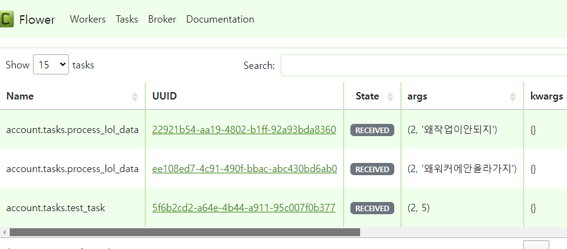
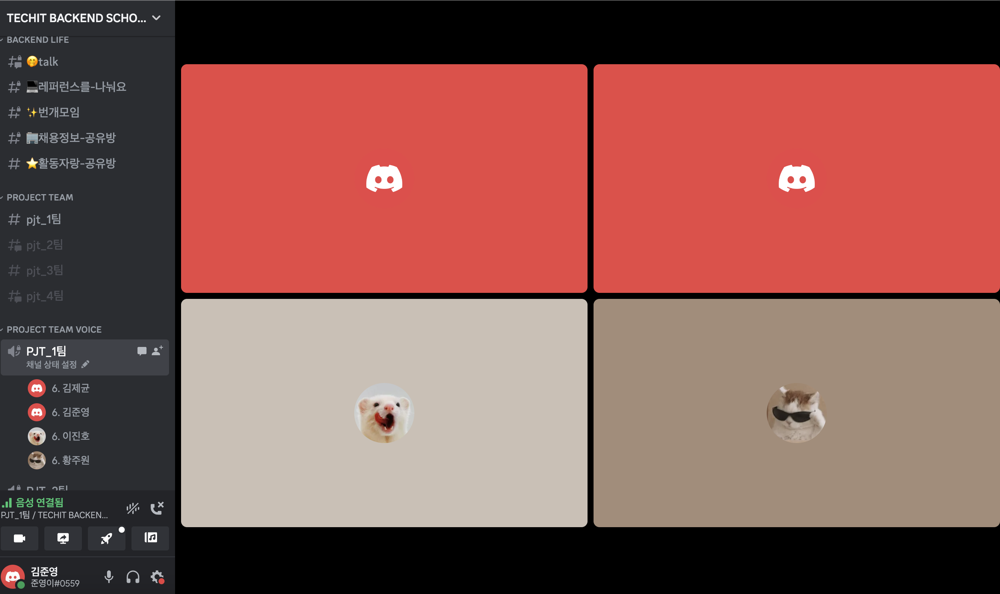

## 팀 구성원, 개인 별 역할

---

김준영: PM 
이진호: 데브옵스 
황주원: 개발 
김제균: 개발 
이노규: 개발 

<br>

## 팀 내부 회의 진행 회차 및 일자

---
- 1회차(2023.09.25) 프로젝트 주제 선정 회의 (김준영, 이진호, 황주원)
- 2회차(2023.09.26) Git브랜치 전략 회의 (김준영, 이진호, 황주원, 김제균, 이노규)
- 3회차(2023.09.26) 모델,API 구성 회의 (김준영, 이진호, 황주원, 김제균, 이노규)
- 4회차(2023.09.27) 연휴간 개발 세분화 및 역할분담 회의 (김준영, 이진호, 황주원, 김제균, 이노규)
- 5회차(2023.10.02) 프로젝트 일정 조율 및 진행방향 회의 (김준영, 이진호)
- 6회차(2023.10.03) Git브랜치 전략 수정 회의 (김준영, 황주원, 김제균)
- 7회차(2023.10.04) 프로젝트 기본기능 개발 완료 발표회 (김준영, 이진호, 황주원, 김제균)
- 8회차(2023.10.04) 프로젝트 프론트엔드,추가기능 회의 (김준영, 이진호, 황주원, 김제균)
- 9회차(2023.10. 5) React로 Frontend 변경 회의 (김준영, 이진호, 황주원, 김제균)
- 10회차(2023. 10. 6) React 업무 분담 회의 (김준영, 이진호, 황주원, 김제균)
- 11회차(2023. 10. 9) Model 수정 회의(API를 위한 수정) (김준영, 이진호, 황주원, 김제균)
- 12회차(2023. 10. 10) 중간 프론트앤드 결산 회의 (김준영, 이진호, 황주원, 김제균)

<br>

## 현재까지 개발 과정 요약

---

김준영

- git branch전략 수립
- 개발환경 구성
- feed모델, crud 구현
- feed 최신글, 추천글 api구현
- 좋아요기능 구현
-  docker-compose 구성
- front-end feed 기능 구현
- back-end feed API 리팩토링

이진호

- feed모델/API 설계
- comment모델/API 설계 및 구현
- 알림모델 설계 및 구현
- celery 설정 및 redis 연동 구현
- RIOT API연동 구현
- 모델 리펙토링, React 설정
- 로그인,회원가입 모달구현 및 요청 오류제어

김제균  

- 유저 모델 작성
- api 이용한 Follow view 작성
- React: 기본 프로필 페이지 구성
- React : 프로필 페이지에 follow, following 구성

황주원 

- 유저 모델 작성
- api 이용한 회원가입, 로그인, 로그아웃 view 작성
-  유저 프로필 편집, 다른 유저 프로필 보기 api 설계 및 구현
- react에서 api 사용하여 프로필 페이지 구성
- react에서 유저 프로필 편집 모달 작성

<br>

## 개발 과정에서 나왔던 질문

---

1. react 파일 업로드

```javascript
const handleSubmit = (event) => {
        event.preventDefault()
        const createFeedForm = event.currentTarget
        if (createFeedForm.checkValidity() === false) {
            event.stopPropagation()
        }
        setValidated(true)

        // const data = {
        //  content: form.body,
        //  image: form.image,
        //  video: form.video,
        // }

        // multipart-form-data 형식으로 보내기 위해서는 요청 본문은 FormData 객체여야 함
        const data = new FormData();
        data.append('content', form.body);
        data.append('image', form.image);
        data.append('video', form.video);


        if (selectedFile) {
            const formData = new FormData();
            formData.append("image", selectedFile);
        }

        // 바이너리 데이터는 전송시 바이트 배열로 변경됨
        // 이 때  사용하는 헤더 -> application/json 형식이 아니라 multipart-form-data
        // 왜냐하면, 바이트 "배열"을 서버로 전송하여야 하기 때문에 한번에 가는 것이 아니라서 multipart-form-data로서 데이터가 여러번 간다는 것을 알려주어야 함
        axiosService
            .post("/feed/", data, {
                headers: {
                    "Content-Type" : "multipart-form-data" //추가
                }
            })
…
```

2. 샐러리 윈도우 이슈

- 샐러리 task의 state가 RECEIVED로 실행이 안되고 무한대기 상태로 되어 실행이 안되었습니다



- 찾아보니 샐러리 4.0부터는 윈도우 IOS를 지원안한다고 합니다

```shell
pip install gevent
```

- 설치함으로써 문제를 해결 할 수 있습니다.


## 개발 결과물 공유

---

Github Repository URL: https://github.com/likelion-backend-6th/WellPlay_app/tree/dev

- 인증샷
  

